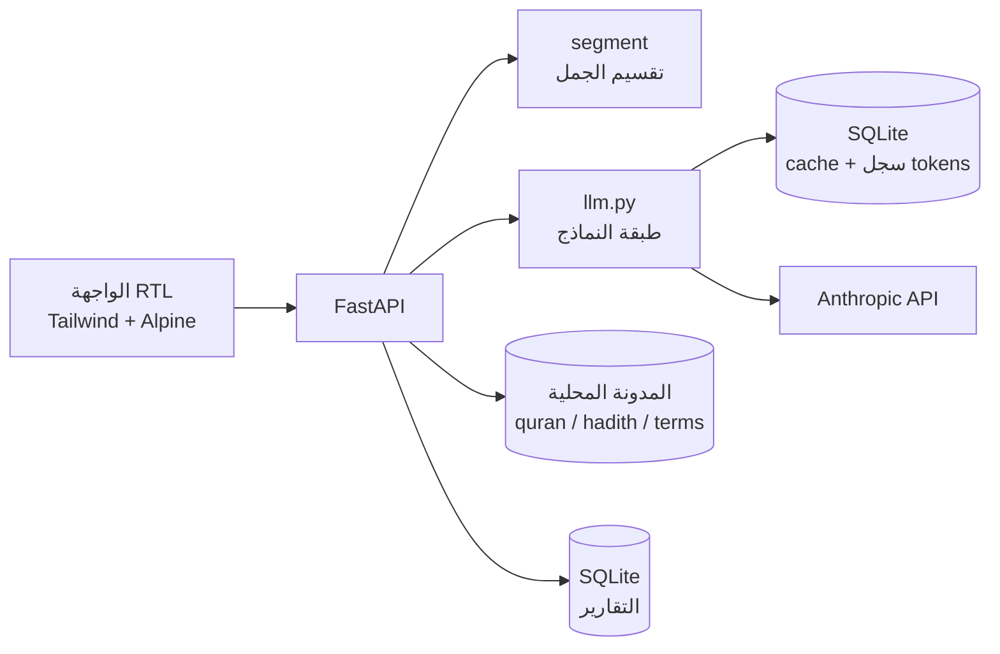

# مِرآة MIRAAH

> «نحافظ على المعنى، لا على الكلمات فقط»

مِرآة منظومة ذكاء اصطناعي تتتبّع **أثر المعنى** في المحتوى الإسلامي عبر سلسلة النسخ
(الأصل العربي ← ترجمة ← ملخص ← ترجمة أخرى). تكشف أين تغيّر المعنى وفي أي حلقة دخل الخلل، وتربط كل تنبيه
بمصدر، والقرار النهائي للمراجع البشري.

⚠️ **أداة مدعومة بالذكاء الاصطناعي للمساعدة في المراجعة، ولا تُصدر فتوى.**

> **الحالة:** المرحلة 0 (بنية تحتية). الواجهة تعرض بيانات وهمية. انظر [BASELINE.md](BASELINE.md).

- الرابط الحي: _يُضاف بعد النشر_

## التشغيل محلياً

```bash
python -m venv .venv
.venv/Scripts/activate        # على Linux و macOS: source .venv/bin/activate
pip install -r requirements.txt
cp .env.example .env          # ثم ضع ANTHROPIC_API_KEY
uvicorn app.main:app --reload
```

بعدها افتح http://localhost:8000 للواجهة، و http://localhost:8000/docs لتوثيق الواجهة البرمجية.

**الاختبارات:**
```bash
pytest -q
```

**تجربة استدعاء النموذج** (تحتاج مفتاحاً):
```bash
python scripts/llm_smoke.py
```

## التشغيل بـ Docker

```bash
docker build -t miraah .
docker run --rm -p 8000:8000 --env-file .env miraah
```

يقرأ التطبيق المنفذ من متغير `PORT`، فيعمل على Render و Hugging Face Spaces.

## المعمارية



## سياسة البيانات
- البيانات اصطناعية فقط، ولا محادثات حقيقية ولا بيانات شخصية.
- المفاتيح في `.env` فقط، وهو مستثنى من git.
- لا يُعدَّل النص المصدر آلياً أبداً، ولا تُختلق المصادر: ما لا يوجد في المدونة المحلية يُعلَّم «غير متحقق».

## المراجع
- [SOURCES.md](SOURCES.md): المكتبات والمصادر وتراخيصها
- [BASELINE.md](BASELINE.md): ما بُني قبل الهاكاثون
- الترخيص: [MIT](LICENSE)

_الأقسام التالية تُكمل في المراحل اللاحقة: نتائج التقييم، والحدود والقيود، وتقدير التكلفة، والبديل عند تعطل المزوّد._
