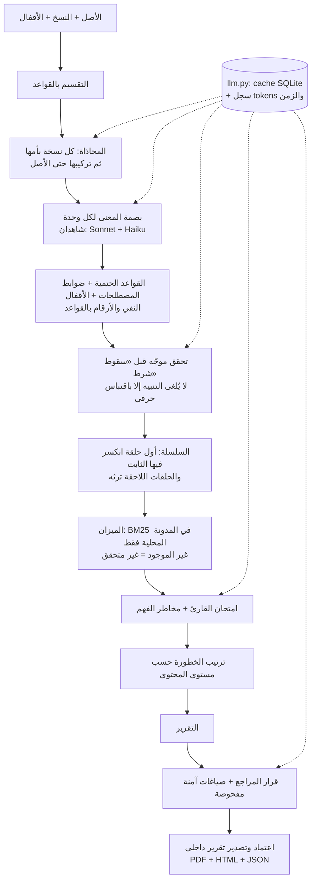

# مِرآة MIRAAH

> «نحافظ على المعنى، لا على الكلمات فقط»

مِرآة منصة تتتبّع **سلامة معنى المحتوى الإسلامي عبر دورة إعادة إنتاجه**: من المصدر العربي إلى ترجمة، فملخص،
فمنشور على وسائل التواصل، فنص فيديو أو إنفوغرافيك، فإجابة مساعد ذكاء اصطناعي (حتى 6 حلقات). تكشف أين تغيّر المعنى (سقوط شرط، رفع درجة يقين، نسبة قول إلى
النبي ﷺ بلا مصدر، تحوّل حكم...) وفي **أي حلقة** دخل الخلل، وتربط كل تنبيه بموضعه في النص أو بعنصر في مدونة
محلية، وتقترح صياغة آمنة، **والقرار النهائي للمراجع البشري**.

⚠️ **أداة مدعومة بالذكاء الاصطناعي للمساعدة في المراجعة، ولا تُصدر فتوى.**

- الرابط الحي: _يُضاف بعد النشر_
- مقدَّم في هاكاثون «تحدي الذكاء الاصطناعي في خدمة المحتوى الإسلامي» (المسار المفتوح: الترجمة والتوطين + التحقق).
- ما بُني قبل الهاكاثون موصوف بدقة في [BASELINE.md](BASELINE.md) (وسم `v0-baseline`).

## خدمتان بمحرك واحد

| | **راجِع قبل النشر** (`/new`) | **تحقّق مما قرأت** (`/reverse`) |
|---|---|---|
| المستخدم | المترجم والمحرر والجهة المنتجة للمحتوى | القارئ |
| يملك النص؟ | نعم، هو كاتبه أو مسؤول عنه | لا |
| سؤاله | «هل ترجمتي سليمة قبل أن أنشرها؟» | «هل ما قرأته يطابق المصدر؟» |
| ما يحصل عليه | التنبيهات ودليلها، و«طبّق التصحيح»، وتقرير داخلي يُصدَّر | الحكم، ثم «هكذا يقول المصدر»، ثم سبب الحكم. **بلا أي زر تعديل** |
| دوره | وقاية قبل النشر | كشف بعد النشر |

الخلل نفسه (سقوط شرط، نسبة بلا مصدر...) يُكتشف في الحالتين، لكن كل مستخدم يحصل على ما يناسبه: من يملك النص يصحّحه،
ومن قرأه يعرف الحكم ومصدره. وفي كل صفحة سطر صغير يقول للمستخدم في أي خدمة هو، وفي نتيجة القارئ رابط لمن كان
كاتب النص فعلاً: «راجِعه قبل النشر».

## الرحلة

1. **الإدخال**: الأصل ومرجعه ومستوى حساسيته (A–D)، وحتى 6 حلقات مع الحلقة الأم ونوع كل حلقة (ترجمة، ملخص، منشور
   تواصل، نص فيديو، نص إنفوغرافيك، إجابة ذكاء اصطناعي)، و**أقفال المعنى** (مقاطع يجب ألا يتغيّر معناها؛ زر «اقترح
   أقفالاً»). أو «جرّب مثالاً» من أربعة أمثلة اصطناعية، منها دورة إنتاج كاملة من 5 حلقات: مسألة خلافية تصير في الملخص
   قولاً قطعياً، ثم في المنشور «الإسلام يوجب»، ثم في نص الفيديو قولاً منسوباً إلى النبي ﷺ.
2. **التحليل** بشريط تقدم يعرض المراحل الحقيقية.
3. **التقرير**: إشارة ضوئية (🟢 جاهز / 🟡 يحتاج نظرة / 🔴 لا تنشر)، و«راجع X جمل من أصل Y»، والسلسلة ملوّنة عند
   الحلقة التي دخل فيها الخلل، وعرض متقابل مظلَّل، وبطاقات تنبيه مع «ليش هذا مهم؟» والدليل، وقسم الميزان، وامتحان
   القارئ، ومخاطر الفهم المحتملة، ونسبة اتفاق الشاهدين.
4. **المراجعة والقرار**: لكل تنبيه زر «طبّق التصحيح» يعرض ثلاث **صياغات آمنة** مُعاد فحصها (أو صياغتك)، وتحته
   رابط «ليس خطأ» بسبب قصير. خلل موضعه الأصل نفسه يُحال إلى مختص. كل قرار في سجل تدقيق، بلا اسم ولا صفة.
5. **الاعتماد والتصدير**: زر «صدّر التقرير» لا يتفعّل إلا بعد حسم كل تنبيه أحمر، ولا يتفعّل أبداً في
   المستوى D. عند الضغط يُنزَّل **تقرير PDF** (خط أميري وتشكيل عربي سليم) بعنوان «تقرير مقابلة – للاستخدام الداخلي،
   وليس شهادة اعتماد عامة»، فيه: المصدر ومرجعه، وحلقات السلسلة، والنص المصحَّح لكل حلقة (الأصل لا يُعدَّل)،
   والتنبيهات وما تم في كل منها، والتاريخ بتوقيت الرياض. (نسختا HTML وJSON متاحتان عبر الواجهة البرمجية.) لا صفحة عامة ولا رابط منشور.

## كيف تعمل



| الوحدة | ما تفعله | نموذج لغوي؟ |
|---|---|---|
| `pipeline/segment.py`، `text/normalize.py` | تقسيم الجمل، وتطبيع العربية | لا |
| `pipeline/align.py` | محاذاة جمل النسخة بجمل الأم (دمج/تقسيم/حذف/إضافة) | نعم |
| `pipeline/fingerprint.py` | بصمة المعنى (القسم 6.2)؛ **النفي والأرقام بالقواعد**؛ والاقتباسات لا تُقبل إلا إن وُجدت حرفياً | نعم + قواعد |
| `pipeline/rules.py` | 15 من أنواع جدول 6.3 (والمصطلحات في fahm، والأقفال في locks: 17 نوعاً كلها)، وقاعدتان من الحزمة العلمية: «انهيار الخلاف إلى قطع» و«تعميم النسبة إلى الإسلام»، بشروح عربية ثابتة | لا |
| `pipeline/chain.py` | `introduced_at` عبر سلسلة حتى 6 حلقات، والوراثة `propagated_to` | لا |
| `pipeline/mizan.py` | كاشف النسبة إلى النبي ﷺ وإلى الله، ودرجات الدعم الخمس | **لا** (BM25) |
| `pipeline/fahm.py` | ضوابط المصطلحات (حتمية)، ومخاطر الفهم (احتمالية) | جزئياً |
| `pipeline/locks.py` | أقفال المعنى واقتراحها وفحصها | جزئياً |
| `pipeline/reader_exam.py` | أسئلة عن الأصل يجيبها قارئ يرى الأصل وحده وقارئ يرى النسخة وحدها | نعم |
| `pipeline/witnesses.py` | اتفاق الشاهدين على الحقول المؤثرة | — |
| `pipeline/revise.py` | ثلاث صياغات آمنة، كل منها يُعاد عبر البصمة والقواعد والميزان والأقفال | نعم |
| `pipeline/severity.py` | الترتيب: النسبة إلى الله ورسوله ﷺ ← الأحكام ← القيود ← المصطلحات ← الأسلوب | لا |
| `pipeline/reverse.py` | «قابِل ما قرأت»: من عبارة قرأها المستخدم إلى مصدرها في المكتبة | جزئياً |

## «قابِل ما قرأت» (Reverse Trace)

> «مِرآة لا تجيب، مِرآة تقابل».

الاتجاه المعاكس للمقابلة: يكتب المستخدم عبارة أو سؤالاً، بأي لغة، عن مسألة قرأها، فترجع مِرآة إلى نص المصدر في
مكتبتها (`data/library/issues.jsonl`) وتقابل بينهما. **النموذج لا يؤلف حكماً ولا يرجّح**: الحكم في النتيجة تُخرجه
قواعد حتمية من مقارنة بصمة العبارة بموقف المصدر كما سُجّل في المكتبة.

| الخطوة | ما يحدث | المحرك |
|---|---|---|
| التصنيف | عبارة · سؤال · حالة شخصية أو طلب فتوى · خارج النطاق. الحالة الشخصية تُلتقط بالقواعد أولاً وتُردّ بعبارة ثابتة وإحالة دون أي تحليل | قواعد + النموذج |
| الاسترجاع | من المكتبة وحدها: الكلمات المفتاحية تحدد المرشّحين، ثم تأكيد دلالي بالنموذج بحد أدنى للثقة 0.6. تحت الحد: «لا يوجد مرجع كافٍ…» | التطبيع + النموذج |
| البصمة | بصمة معنى العبارة | `fingerprint` القائم |
| المقابلة | الحكم، والشروط والاستثناءات (بالتحقق الموجّه مع اقتباس حرفي)، والنطاق، ودعوى الإجماع | قواعد حتمية + `find_in_version` |
| الشرح | فرق العبارة عن المصدر فقط. أي نص بين علامات تنصيص يجب أن يوجد حرفياً في المكتبة، وإلا يُحذف الشرح ويُعرض الحكم وحده | النموذج + فحص آلي |
| الميزان | إن نسبت العبارة كلاماً إلى النبي ﷺ يُفحص في المدونة | `mizan.verify` |

**النتائج الممكنة:** مطابق للمصدر · مطابق جزئياً (مع بيان الناقص: شرط، استثناء، نطاق) · متعارض مع المصدر ·
مسألة خلافية · لا مرجع كافٍ. وللسؤال بلا عبارة: «نصوص المصدر» وترجمتها المعتمدة فقط.

**قواعد إلزامية:**
- في المسألة الخلافية (`khilaf: true`) لا يكون الحكم «متعارض» أبداً؛ تُعرض «مسألة خلافية» مع الأقوال كما في المصدر وإحالة للمختص.
- ادعاء الاتفاق أو الإجماع على مسألة خلافية يُوسم «زيادة: ادعاء اتفاق غير ثابت».
- المدخلات العدائية تُعامل بالمنطق نفسه وبعبارات ثابتة هادئة، ونص المستخدم يُعامل بيانات لا تعليمات.

**الخصوصية:** نص المستخدم لا يُحفظ، ولا يدخل cache الاستجابات (يُعطَّل لهذه الميزة)، وسجل الاستدعاءات يحفظ عدد
الـtokens فقط. يُحفظ النص فقط إذا اختار المستخدم «احفظ هذه المقابلة»، فيحصل على رابط دائم. ولا يُستنتج دين المستخدم
أو هويته من سؤاله.

**حدود الميزة الآن (بصراحة):**
- **المكتبة صغيرة**: 21 مسألة من كتابين للشيخ ابن باز على موقعه الرسمي: 9 في الصيام (binbaz.org.sa/books/pdf/215)
  و12 في الحج والعمرة (binbaz.org.sa/books/pdf/610). ما خرج عنها يعود بـ«لا مرجع كافٍ». المقتطفات حرفية، لكن الملف
  الأول ممسوح ضوئياً وفيه أخطاء تعرّف قليلة، والثاني نُقل من صورة الصفحة لتلف طبقة نصه. لم تُراجَع بعدُ على الصفحات،
  فتظهر بلافتة تقول ذلك. لا ترجمة إنجليزية معتمدة فيها.
- **لم تُجرَّب على النموذج الحقيقي بعد**، لأن رصيد الـ API نفد وقت البناء. الاختبارات (31 اختباراً) تعمل بنموذج وهمي.
- الاسترجاع يحتاج كلمة مفتاحية واحدة على الأقل من المسألة؛ المرادفات غير المسجّلة في `keywords_*` لا تُلتقط.
- في المسألة الخلافية لا تُقارَن العبارة بقول بعينه، لأن `opinions` نصوص حرة؛ فالنتيجة «مسألة خلافية» دائماً، وهذا الأحوط.
- لا يوجد في التطبيق حدّ لمعدل الطلبات (ولا في بقية الواجهة البرمجية)؛ الحد الوحيد طول المدخل: 3 إلى 1000 حرف.
- **صيغة حقول `position`:** الشروط والاستثناءات والنطاق تُقارن بالتحقق الموجّه فتصلح بأي لغة، لكن الأدق كتابتها
  عبارات إنجليزية قصيرة (مثل `if the tester is ready`) لأنها تُطابق أولاً ببصمة العبارة.

## نتائج التقييم

التفاصيل الكاملة في [eval/results.md](eval/results.md)، والنصوص والتنبؤات في `eval/results.json`.
47 حالة (28 تغيّراً مزروعاً، 15 صياغة سليمة المعنى، 4 حالات امتناع).

| المقياس | مِرآة 10-01 (3 تشغيلات) | مِرآة 10-02 بعد إصلاح النفي والأرقام (تشغيل واحد) | خط الأساس (chrF < 50 أو الطول < 65٪) |
|---|---|---|---|
| كشف التغيّر المزروع | 96٪ | **96٪** | 14٪ |
| إنذارات كاذبة على الصياغات السليمة | 44٪ (40٪–47٪) | **20٪** | 73٪ |
| صحة الامتناع («غير متحقق» + العبارة الثابتة) | 100٪ | 100٪ | — |
| الثبات عبر التشغيلات | 77٪ | يُقاس في التقييم الكامل | — |
| اتفاق الشاهدين (الحقول المؤثرة) | 47٪ | 47٪ | — |
| متوسط chrF لحالات التغيّر / للسليمة | — | — | 78.8 / 44.2 |
| الزمن لكل جملة (بلا cache) | 18.5 ث | 6.2 ث | — |

**الخلاصة الصادقة:** المقاييس السطحية تعطي النسخ المحرَّفة درجة chrF عالية (78.8، أعلى من الصياغات السليمة نفسها)
فلا ترى الخلل، بينما تكشفه مِرآة في 96٪ من الحالات. كانت الإنذارات الكاذبة 44٪، وأكبر مصادرها عدّ أدوات النفي
والأرقام آلياً بين لغتين؛ بعد الإصلاح (النفي اللفظي يُقارن بخلاصة المعنى، والمثنّى العربي، و«لغير»، و«لا… حتى»)
صارت 20٪ مع بقاء الكشف 96٪. رقم 10-02 من تشغيل واحد، ويُعاد التقييم الكامل بثلاثة تشغيلات قبل التسليم.

## الحدود والقيود (بصراحة)

- **التقييم أولي**: البذور الـ15 مسودة لم تراجعها المطوّرة بعد، والحالات المزروعة والصياغات «السليمة» مولّدة بنموذج.
  47 حالة فقط، وبعض الأنواع ظهرت مرة واحدة لكل تشغيل، فأرقامها غير مستقرة إحصائياً.
- **الإنذارات الكاذبة 20٪** (بعد أن كانت 44٪): ما بقي منها في `certainty_raised` و`scope_widened` (قراءة النموذج
  للنطاق واليقين)، وحالة نفي لفظي واحدة. بين لغتين لا يُنبَّه على النفي إلا إن انقلب في خلاصة المعنى أيضاً، وهذا
  قد يُفوّت نفياً سقط من النص ولم تلتقطه الخلاصة (75٪ استدعاء للنفي في آخر تشغيل).
- **أنواع ضعيفة**: `attribution_upgraded` لا يلتقط حذف «رُوي» كلياً (يصير النص بلا نسبة لا «جازماً»)،
  و`exception_dropped` يُصنَّف غالباً «سقوط شرط» (يُكتشف الخلل لكن بنوع آخر).
- **اتفاق الشاهدين 47٪**: الشاهد الثاني (Haiku) يقرأ حقولاً لينة كالنطاق والنسبة بشكل مختلف؛ الاختلاف يخفض الثقة
  ويُظهر «مختلف فيه» ولا يُلغي التنبيه.
- **المدونة صغيرة**: 3 آيات و3 أحاديث مثالاً، و12 ضابط مصطلح (10 منها من الحزمة العلمية). أي حديث صحيح غير موجود فيها يظهر «غير متحقق» (امتناع، لا حكم)؛
  هذا مقصود، لكنه يعني تنبيهات كثيرة حتى تُملأ المدونة.
- **مطابقة الشروط بين اللغات** تعتمد على تشابه عبارات إنجليزية موحّدة + تحقق موجّه؛ قد تخطئ في الصياغات البعيدة.
- **`length_drop`** لا يعمل إلا حين تكون الحلقة وأمها بلغة واحدة.
- **التقسيم** لا يقطع عند «؛» و«،» عمداً، فالجمل العربية الطويلة جداً تبقى وحدة واحدة.
- **ثبات النتائج** يأتي من cache الاستجابات: Sonnet 5.5 يرفض `temperature=0`، فبدون cache تتغيّر النتائج (الثبات 77٪).
- الأمثلة والبذور اصطناعية؛ لم تُختبر الأداة بعدُ مع مترجمين حقيقيين.

## التكلفة

من سجل tokens الفعلي (`llm_calls`) أثناء التقييم بلا cache، بالإعداد الحالي (Sonnet 5.5 + Haiku 4.5 شاهداً ثانياً،
مع امتحان القارئ ومخاطر الفهم):

| البند | القيمة |
|---|---|
| تقدير التكلفة لكل 1000 جملة (حلقة واحدة لكل جملة) | **≈ 23–40 دولاراً** (40 في تقييم 10-01، و23 في تشغيل 10-02) |
| الزمن لكل جملة | ≈ 6–18 ثانية (4 تحليلات متوازية) |
| إعادة تحليل نص سبق تحليله | مجاناً وفورياً (cache) |

معظم التكلفة من تعليمات البصمة الثابتة (≈ 3,500 token لكل استدعاء). خيارات خفضها: تخزين التعليمات مؤقتاً لدى
Anthropic (prompt caching)، أو تعطيل الشاهد الثاني (`WITNESS_B_MODEL=` فارغ)، أو `LLM_EFFORT=low`.

## البديل عند تعطل مزوّد النموذج

ما هو موجود فعلاً:
- **التقارير السابقة وتصديرها يبقيان متاحين**، وكل نص سبق تحليله يُعاد من cache SQLite بلا اتصال.
- **فشل المزوّد لا ينتج تقريراً ناقصاً صامتاً**: إن فشلت المراحل الأساسية يظهر «تعذّر التحليل» برسالة عربية واضحة
  (نفاد الرصيد، مفتاح غير صحيح، ضغط على الخدمة، انقطاع الاتصال) والتفاصيل التقنية قابلة للطي،
  وإن فشلت المراحل المساعدة (امتحان القارئ، مخاطر الفهم) يكتمل التقرير مع تحذير ظاهر.
- **تبديل النموذج من `.env`** دون تعديل الكود (`MAIN_MODEL`، `WITNESS_A_MODEL`، `WITNESS_B_MODEL`)؛ ومع شاهد واحد
  يعمل النظام ويذكر ذلك في التقرير.
- مكونات لا تحتاج نموذجاً أصلاً: الميزان (BM25)، وضوابط المصطلحات، وعدّ النفي والأرقام، والتقسيم والتطبيع.

ما ليس موجوداً (حدّ معروف): لا مزوّد بديل غير Anthropic، ولا «وضع بلا نموذج» يحلل نصاً جديداً بالقواعد وحدها.
حدث فعلياً أثناء التقييم أن **نفد رصيد API**، فسُجّلت الأخطاء واستُبعدت الحالات المتأثرة ظاهراً في النتائج.

## التشغيل محلياً

```bash
python -m venv .venv
.venv/Scripts/activate        # على Linux و macOS: source .venv/bin/activate
pip install -r requirements.txt
cp .env.example .env          # ثم ضع ANTHROPIC_API_KEY
uvicorn app.main:app --reload
```

افتح http://localhost:8000 للواجهة، و http://localhost:8000/docs لتوثيق الواجهة البرمجية.

```bash
pytest -q                                  # الاختبارات
python scripts/llm_smoke.py                # استدعاء واحد للتحقق من المفتاح
python eval/generate_cases.py              # توليد حالات التقييم من data/eval/seeds.jsonl
python eval/run_eval.py --runs 3           # التقييم الكامل (يكلّف نحو 4 دولارات)
python eval/run_eval.py --from-json        # إعادة حساب النتائج بلا استدعاءات
```

## التشغيل بـ Docker

```bash
docker build -t miraah .
docker run --rm -p 8000:8000 --env-file .env miraah
```

يقرأ التطبيق المنفذ من `PORT`، فيعمل على Render و Hugging Face Spaces (جُرِّب بـ `PORT=7860`). ضع
`ANTHROPIC_API_KEY` في إعدادات الأسرار (Secrets) في المنصة، لا في الملفات.

## الواجهة البرمجية

| المسار | الوظيفة |
|---|---|
| `POST /api/analyze` | يحلل الأصل ونسخه (حتى 4) ويعيد التقرير كاملاً؛ `?background=true` يعيد المعرّف فوراً |
| `GET /api/report/{id}` · `/status` · `/audit` | التقرير، ومرحلة التحليل، وسجل التدقيق |
| `POST /api/revise` | ثلاث صياغات آمنة مفحوصة لتنبيه |
| `POST /api/decision` | قرار المراجع: `edit` (طبّق التصحيح) أو `reject` (ليس خطأ، بسبب) أو `accept` (إحالة خلل في الأصل، بسبب) |
| `POST /api/approve` | اعتماد المراجع (يُرفض ما لم تُحسم كل التنبيهات الحمراء، ودائماً في المستوى D) |
| `GET /api/report/{id}/export.pdf` · `export.html` · `export.json` | تنزيل التقرير الداخلي المعتمد (PDF، وHTML، وJSON) |
| `POST /api/locks/suggest` | أقفال مقترحة من الأصل |
| `POST /api/reverse` | «قابِل ما قرأت»: `{text, save}` ← الحكم والمصدر والملاحظات والشرح. لا يُحفظ النص إلا مع `save: true` |
| `POST /reverse` · `GET /reverse/{id}` | نتيجة «قابِل ما قرأت» من شريط الصفحة الرئيسية، ونتيجة محفوظة باختيار المستخدم |
| `GET /api/examples` · `GET /api/health` | الأمثلة، والحالة |

التوثيق التفاعلي على `/docs`.

## سياسة البيانات

- **البيانات اصطناعية فقط**: لا محادثات حقيقية ولا بيانات شخصية. التقرير المصدَّر لا يذكر اسم المراجع ولا صفته،
  ولا يُنشر في أي صفحة عامة.
- **لا أسرار في المستودع**: المفاتيح في `.env` فقط، وهو مستثنى من git؛ فُحص التاريخ كاملاً قبل كل رفع.
- **لا يُعدَّل النص المصدر آلياً أبداً**، ولا صياغات آمنة لتنبيه موضعه الأصل نفسه.
- **لا اختلاق للمصادر**: الميزان يبحث في المدونة المحلية فقط؛ وما لا يوجد فيها «غير متحقق» مع العبارة الثابتة
  «لم نعثر على هذا النص في المصادر المعتمدة المتاحة لمِرآة»، ولا يُقال «حديث مكذوب» أبداً.
- **لا استنتاج لهوية المستخدم**: مخاطر الفهم تُصاغ احتمالاً ولا تفترض دين القارئ أو هويته.
- النصوص المُرسلة للتحليل تُعالَج عبر Anthropic API وتُحفظ محلياً في SQLite (`data/runtime/`، مستثنى من git).

## تحسينات بناءً على اختبار المستخدمين

| الملاحظة | التعديل |
|---|---|
| (تجربة المطوّرة) صفحة المراجعة تفشل بعد طلب الصياغات الآمنة | إصلاح تحويل البيانات في القالب + اختبار يمنع التكرار |
| (تجربة المطوّرة) كُتبت الصياغة نفسها في خانة السبب، ولم تظهر الصياغة المعتمدة في المخرج النهائي | التقرير المصدَّر يعرض الصياغة والسبب منفصلين، ويُرفض القرار إذا كان السبب هو الصياغة نفسها |
| (قرار المطوّرة) صفحة «ختم» عامة توحي بشهادة اعتماد، وصفة المراجع لا يتحقق منها أحد | أُزيل الختم العام كاملاً، وحلّ محله تقرير داخلي يُصدَّر بعنوان صريح أنه ليس شهادة، وأُزيلت الصفة |

_يُستكمل بعد اختبار المستخدمين (مترجمين أو أصدقاء)._

## خطط مستقبلية

- **ختم عام بمراجعين موثّقين من جهاتهم**: صفحة عامة للقراءة فقط تُثبت أن النسخة روجعت، لكن لا تصدر إلا عن مراجع
  وثّقته جهته (دار ترجمة أو جهة علمية) لا عن صفة يعلنها المستخدم بنفسه، مع بصمة للنصوص تكشف أي تعديل بعد المراجعة.
  أُزيل الختم من النسخة الحالية لأنه لا توثيق فيها للمراجع، فلا يصح أن يظهر للجمهور كأنه شهادة.

## المراجع

- [SOURCES.md](SOURCES.md): كل مكتبة ومصدر وترخيصه
- [BASELINE.md](BASELINE.md): ما بُني قبل الهاكاثون
- [eval/results.md](eval/results.md): نتائج التقييم كاملة
- الترخيص: [MIT](LICENSE)
