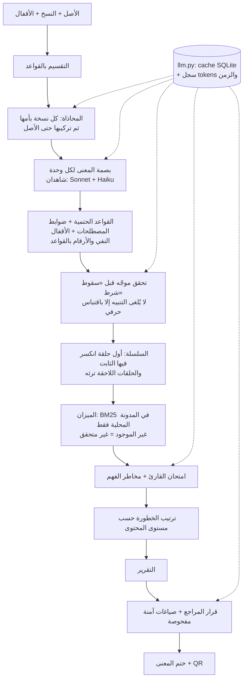

# مِرآة MIRAAH

> «نحافظ على المعنى، لا على الكلمات فقط»

مِرآة منظومة ذكاء اصطناعي تتتبّع **أثر المعنى** في المحتوى الإسلامي عبر سلسلة النسخ:
الأصل العربي ← ترجمة ← ملخص ← ترجمة أخرى. تكشف أين تغيّر المعنى (سقوط شرط، رفع درجة يقين، نسبة قول إلى
النبي ﷺ بلا مصدر، تحوّل حكم...) وفي **أي حلقة** دخل الخلل، وتربط كل تنبيه بموضعه في النص أو بعنصر في مدونة
محلية، وتقترح صياغة آمنة، **والقرار النهائي للمراجع البشري**.

⚠️ **أداة مدعومة بالذكاء الاصطناعي للمساعدة في المراجعة، ولا تُصدر فتوى.**

- الرابط الحي: _يُضاف بعد النشر_
- مقدَّم في هاكاثون «تحدي الذكاء الاصطناعي في خدمة المحتوى الإسلامي» (المسار المفتوح: الترجمة والتوطين + التحقق).
- ما بُني قبل الهاكاثون موصوف بدقة في [BASELINE.md](BASELINE.md) (وسم `v0-baseline`).

## الرحلة

1. **الإدخال**: الأصل ومرجعه ومستوى حساسيته (A–D)، وحتى 4 نسخ مع تحديد الحلقة الأم لكل نسخة، و**أقفال المعنى**
   (مقاطع يجب ألا يتغيّر معناها؛ زر «اقترح أقفالاً»). أو «جرّب مثالاً» من ثلاثة أمثلة جاهزة.
2. **التحليل** بشريط تقدم يعرض المراحل الحقيقية.
3. **التقرير**: إشارة ضوئية (🟢 جاهز / 🟡 يحتاج نظرة / 🔴 لا تنشر)، و«راجع X جمل من أصل Y»، والسلسلة ملوّنة عند
   الحلقة التي دخل فيها الخلل، وعرض متقابل مظلَّل، وبطاقات تنبيه مع «ليش هذا مهم؟» والدليل، وقسم الميزان، وامتحان
   القارئ، ومخاطر الفهم المحتملة، ونسبة اتفاق الشاهدين.
4. **المراجعة والقرار**: لكل تنبيه قبول/رفض/تعديل بسبب إلزامي في سجل تدقيق، وثلاث **صياغات آمنة** مُعاد فحصها،
   وزر «جاهز للنشر» لا يتفعّل إلا بعد حسم كل تنبيه أحمر.
5. **ختم المعنى** `/seal/{id}`: صفحة عامة للقراءة فقط مع QR، والصياغة المعتمدة والسبب لكل قرار، وصفة المراجع
   (لا اسمه)، وبصمة SHA-256 لكل نص وبصمة للختم.

## كيف تعمل



| الوحدة | ما تفعله | نموذج لغوي؟ |
|---|---|---|
| `pipeline/segment.py`، `text/normalize.py` | تقسيم الجمل، وتطبيع العربية | لا |
| `pipeline/align.py` | محاذاة جمل النسخة بجمل الأم (دمج/تقسيم/حذف/إضافة) | نعم |
| `pipeline/fingerprint.py` | بصمة المعنى (القسم 6.2)؛ **النفي والأرقام بالقواعد**؛ والاقتباسات لا تُقبل إلا إن وُجدت حرفياً | نعم + قواعد |
| `pipeline/rules.py` | 15 من أنواع جدول 6.3 (والمصطلحات في fahm، والأقفال في locks: 17 نوعاً كلها) بشروح عربية ثابتة | لا |
| `pipeline/chain.py` | `introduced_at` عبر سلسلة حتى 4 حلقات، والوراثة `propagated_to` | لا |
| `pipeline/mizan.py` | كاشف النسبة إلى النبي ﷺ وإلى الله، ودرجات الدعم الخمس | **لا** (BM25) |
| `pipeline/fahm.py` | ضوابط المصطلحات (حتمية)، ومخاطر الفهم (احتمالية) | جزئياً |
| `pipeline/locks.py` | أقفال المعنى واقتراحها وفحصها | جزئياً |
| `pipeline/reader_exam.py` | أسئلة عن الأصل يجيبها قارئ يرى الأصل وحده وقارئ يرى النسخة وحدها | نعم |
| `pipeline/witnesses.py` | اتفاق الشاهدين على الحقول المؤثرة | — |
| `pipeline/revise.py` | ثلاث صياغات آمنة، كل منها يُعاد عبر البصمة والقواعد والميزان والأقفال | نعم |
| `pipeline/severity.py` | الترتيب: النسبة إلى الله ورسوله ﷺ ← الأحكام ← القيود ← المصطلحات ← الأسلوب | لا |

## نتائج التقييم

التفاصيل الكاملة في [eval/results.md](eval/results.md)، والنصوص والتنبؤات في `eval/results.json`.
47 حالة (28 تغيّراً مزروعاً، 15 صياغة سليمة المعنى، 4 حالات امتناع)، 3 تشغيلات (الثاني والثالث بلا cache).

| المقياس | مِرآة | خط الأساس (chrF < 50 أو الطول < 65٪) |
|---|---|---|
| كشف التغيّر المزروع | **96٪** | 14٪ |
| إنذارات كاذبة على الصياغات السليمة | 44٪ (40٪–47٪) | 73٪ |
| صحة الامتناع («غير متحقق» + العبارة الثابتة) | 100٪ | — |
| الثبات عبر التشغيلات | 77٪ | — |
| اتفاق الشاهدين (الحقول المؤثرة) | 47٪ | — |
| متوسط chrF لحالات التغيّر / للسليمة | — | 78.8 / 44.2 |
| الزمن لكل جملة | 18.5 ث | — |

**الخلاصة الصادقة:** المقاييس السطحية تعطي النسخ المحرَّفة درجة chrF عالية (78.8، أعلى من الصياغات السليمة نفسها)
فلا ترى الخلل، بينما تكشفه مِرآة في 96٪ من الحالات. لكن **نسبة الإنذارات الكاذبة مرتفعة (44٪)**، وأكبر مصادرها
عدّ أدوات النفي والأرقام آلياً بين لغتين (15 و9 إنذارات كاذبة)، وتفاصيلها في قسم الحدود.

## الحدود والقيود (بصراحة)

- **التقييم أولي**: البذور الـ15 مسودة لم تراجعها المطوّرة بعد، والحالات المزروعة والصياغات «السليمة» مولّدة بنموذج.
  47 حالة فقط، وبعض الأنواع ظهرت مرة واحدة لكل تشغيل، فأرقامها غير مستقرة إحصائياً.
- **الإنذارات الكاذبة 44٪**: عدّ النفي آلياً لا يصلح بين لغتين («الجاهل» ← "does not know»)، والمثنّى العربي
  («الجمعتين») لا يُعدّ رقماً بينما "two Fridays" يُعدّ. مقترحات الإصلاح موثّقة وتنتظر موافقة المطوّرة.
- **أنواع ضعيفة**: `attribution_upgraded` لا يلتقط حذف «رُوي» كلياً (يصير النص بلا نسبة لا «جازماً»)،
  و`exception_dropped` يُصنَّف غالباً «سقوط شرط» (يُكتشف الخلل لكن بنوع آخر).
- **اتفاق الشاهدين 47٪**: الشاهد الثاني (Haiku) يقرأ حقولاً لينة كالنطاق والنسبة بشكل مختلف؛ الاختلاف يخفض الثقة
  ويُظهر «مختلف فيه» ولا يُلغي التنبيه.
- **المدونة صغيرة**: 9 عناصر مثال فقط حالياً. أي حديث صحيح غير موجود فيها يظهر «غير متحقق» (امتناع، لا حكم)؛
  هذا مقصود، لكنه يعني تنبيهات كثيرة حتى تُملأ المدونة.
- **مطابقة الشروط بين اللغات** تعتمد على تشابه عبارات إنجليزية موحّدة + تحقق موجّه؛ قد تخطئ في الصياغات البعيدة.
- **`length_drop`** لا يعمل إلا حين تكون الحلقة وأمها بلغة واحدة.
- **التقسيم** لا يقطع عند «؛» و«،» عمداً، فالجمل العربية الطويلة جداً تبقى وحدة واحدة.
- **ثبات النتائج** يأتي من cache الاستجابات: Sonnet 5.5 يرفض `temperature=0`، فبدون cache تتغيّر النتائج (الثبات 77٪).
- الأمثلة والبذور اصطناعية؛ لم تُختبر الأداة بعدُ مع مترجمين حقيقيين.

## التكلفة

من سجل tokens الفعلي (`llm_calls`) أثناء التقييم بلا cache، بالإعداد الحالي (Sonnet 5.5 + Haiku 4.5 شاهداً ثانياً،
مع امتحان القارئ ومخاطر الفهم):

| البند | القيمة |
|---|---|
| تقدير التكلفة لكل 1000 جملة (حلقة واحدة لكل جملة) | **≈ 40 دولاراً** |
| الزمن لكل جملة | ≈ 18 ثانية (4 تحليلات متوازية) |
| إعادة تحليل نص سبق تحليله | مجاناً وفورياً (cache) |

معظم التكلفة من تعليمات البصمة الثابتة (≈ 3,500 token لكل استدعاء). خيارات خفضها: تخزين التعليمات مؤقتاً لدى
Anthropic (prompt caching)، أو تعطيل الشاهد الثاني (`WITNESS_B_MODEL=` فارغ)، أو `LLM_EFFORT=low`.

## البديل عند تعطل مزوّد النموذج

ما هو موجود فعلاً:
- **التقارير السابقة والصفحات المنشورة تبقى متاحة**، وكل نص سبق تحليله يُعاد من cache SQLite بلا اتصال.
- **فشل المزوّد لا ينتج تقريراً ناقصاً صامتاً**: إن فشلت المراحل الأساسية يظهر التحليل «تعذّر» مع رسالة الخطأ،
  وإن فشلت المراحل المساعدة (امتحان القارئ، مخاطر الفهم) يكتمل التقرير مع تحذير ظاهر.
- **تبديل النموذج من `.env`** دون تعديل الكود (`MAIN_MODEL`، `WITNESS_A_MODEL`، `WITNESS_B_MODEL`)؛ ومع شاهد واحد
  يعمل النظام ويذكر ذلك في التقرير.
- مكونات لا تحتاج نموذجاً أصلاً: الميزان (BM25)، وضوابط المصطلحات، وعدّ النفي والأرقام، والتقسيم والتطبيع.

ما ليس موجوداً (حدّ معروف): لا مزوّد بديل غير Anthropic، ولا «وضع بلا نموذج» يحلل نصاً جديداً بالقواعد وحدها.
حدث فعلياً أثناء التقييم أن **نفد رصيد API**، فسُجّلت الأخطاء واستُبعدت الحالات المتأثرة ظاهراً في النتائج.

## التشغيل محلياً

```bash
python -m venv .venv
.venv/Scripts/activate        # على Linux و macOS: source .venv/bin/activate
pip install -r requirements.txt
cp .env.example .env          # ثم ضع ANTHROPIC_API_KEY
uvicorn app.main:app --reload
```

افتح http://localhost:8000 للواجهة، و http://localhost:8000/docs لتوثيق الواجهة البرمجية.

```bash
pytest -q                                  # الاختبارات
python scripts/llm_smoke.py                # استدعاء واحد للتحقق من المفتاح
python eval/generate_cases.py              # توليد حالات التقييم من data/eval/seeds.jsonl
python eval/run_eval.py --runs 3           # التقييم الكامل (يكلّف نحو 4 دولارات)
python eval/run_eval.py --from-json        # إعادة حساب النتائج بلا استدعاءات
```

## التشغيل بـ Docker

```bash
docker build -t miraah .
docker run --rm -p 8000:8000 --env-file .env miraah
```

يقرأ التطبيق المنفذ من `PORT`، فيعمل على Render و Hugging Face Spaces (جُرِّب بـ `PORT=7860`). ضع
`ANTHROPIC_API_KEY` في إعدادات الأسرار (Secrets) في المنصة، لا في الملفات.

## الواجهة البرمجية

| المسار | الوظيفة |
|---|---|
| `POST /api/analyze` | يحلل الأصل ونسخه (حتى 4) ويعيد التقرير كاملاً؛ `?background=true` يعيد المعرّف فوراً |
| `GET /api/report/{id}` · `/status` · `/audit` | التقرير، ومرحلة التحليل، وسجل التدقيق |
| `POST /api/revise` | ثلاث صياغات آمنة مفحوصة لتنبيه |
| `POST /api/decision` | قرار المراجع (قبول/رفض/تعديل) بسبب إلزامي |
| `POST /api/publish` | النشر (يُرفض ما لم تُحسم كل التنبيهات الحمراء) |
| `POST /api/locks/suggest` | أقفال مقترحة من الأصل |
| `GET /seal/{id}` | صفحة الختم العامة |
| `GET /api/examples` · `GET /api/health` | الأمثلة، والحالة |

التوثيق التفاعلي على `/docs`.

## سياسة البيانات

- **البيانات اصطناعية فقط**: لا محادثات حقيقية ولا بيانات شخصية. صفحة الختم تعرض صفة المراجع لا اسمه.
- **لا أسرار في المستودع**: المفاتيح في `.env` فقط، وهو مستثنى من git؛ فُحص التاريخ كاملاً قبل كل رفع.
- **لا يُعدَّل النص المصدر آلياً أبداً**، ولا صياغات آمنة لتنبيه موضعه الأصل نفسه.
- **لا اختلاق للمصادر**: الميزان يبحث في المدونة المحلية فقط؛ وما لا يوجد فيها «غير متحقق» مع العبارة الثابتة
  «لم نعثر على هذا النص في المصادر المعتمدة المتاحة لمِرآة»، ولا يُقال «حديث مكذوب» أبداً.
- **لا استنتاج لهوية المستخدم**: مخاطر الفهم تُصاغ احتمالاً ولا تفترض دين القارئ أو هويته.
- النصوص المُرسلة للتحليل تُعالَج عبر Anthropic API وتُحفظ محلياً في SQLite (`data/runtime/`، مستثنى من git).

## تحسينات بناءً على اختبار المستخدمين

| الملاحظة | التعديل |
|---|---|
| (تجربة المطوّرة) صفحة المراجعة تفشل بعد طلب الصياغات الآمنة | إصلاح تحويل البيانات في القالب + اختبار يمنع التكرار |
| (تجربة المطوّرة) كُتبت الصياغة نفسها في خانة السبب، والختم لا يعرض الصياغة المعتمدة | الختم يعرض الصياغة والسبب منفصلين، ويُرفض القرار إذا كان السبب هو الصياغة نفسها |

_يُستكمل بعد اختبار المستخدمين (مترجمين أو أصدقاء)._

## المراجع

- [SOURCES.md](SOURCES.md): كل مكتبة ومصدر وترخيصه
- [BASELINE.md](BASELINE.md): ما بُني قبل الهاكاثون
- [eval/results.md](eval/results.md): نتائج التقييم كاملة
- الترخيص: [MIT](LICENSE)
